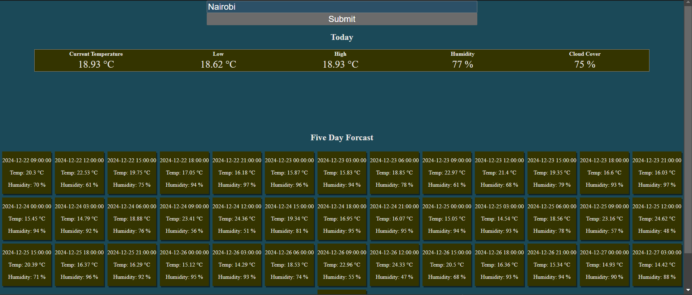

# Visualizing Temperature

My end product looks like this



## Problem Statement

Many public APIs require some degree of authentication in order to use them.
Learning how to set up API authentication and how to use API documentation will
open up access to huge amounts of free, useful data.

In this lab, we will be practicing the use of an API that requires
authentication as well as explore how to present API data in
multiple ways.


## Objectives

* Build a page that uses data from the [Open Weather Map API][openweather] to display
current and forecasted weather information
* Learn how to use `fetch` to get up-to-date data
* Bonus: Render a line chart using [Chart.js](http://chartkick.com/) to provide a visual display of fetched data

## Instructions

First, sign up for an account to generate an Open Weather Map API key
[here](https://openweathermap.org/appid). You'll use this key for API calls. It
may take around 10 minutes before your API key is fully activated, so in the
meantime, you can start writing out the JavaScript inside `js/index.js`, using
the provided functions.

This API uses URL parameters for queries, meaning that the whatever is entered
into our form will need to be included with the URL, along with your API key.
Use the API documentation to find examples of how to structure these parameters.

* In `index.html`, there is an existing form for input of a city name. Create an
event listener that, on 'submit', sends a fetch request to the Open Weather API.
The beginning of the url for your fetch request should be the following:

```js
`https://api.openweathermap.org/data/2.5/weather?`
```

* Upon successful response, use the provided table and ids within `index.html` to
populate the DOM with weather information

**Note:** It is a good idea to `console.log` the JSON output of your fetch requests. If
you are testing your code and sending frequent API requests, you may hit your
rate limit and stop receiving data. Logging the JSON output will let you see
if this is occurring.  If you have hit your limit, wait for a few minutes before
trying again. Trying too many times while at a rate limit may cause your API key
to be deactivated for up to 24 hours.

* Make sure your code handles any spaces entered into your form. Submissions like
'New York' should return the correct weather data. For URL parameters, these
spaces are typically represented with a `+` symbol. This API is not perfect, so
while 'New York' will work, fetching with a term like 'New York City' will
return an error regardless of what you do.

* Create a _second_ fetch request for a _different_ endpoint on the Open Weather
API, the five day forecast. This time, use the following as a base for
your fetch URL:

```js
`https://api.openweathermap.org/data/2.5/forecast?`
```

In the returned JSON data, there will be a key, `list`, an array of weather
information for every three hours for the next five days. Iterate over this
array and display each three hour forecast as its own `div` that displays
`dt_txt`, `temp`, and `humidity`. Append these `div` child elements within the
`<aside>` element in `index.html`.

* Bonus: Using the five day forecast data and the [ChartJS][chartjs] library, render
a line graph in `index.html`. The library has already been made available in
`index.html` and the canvas element is provided, but you'll need to use the
examples in the [ChartJS][example] documentation to figure out how to display
the chart on the page. Within the `json.list` from the weather API, use the
`dt_txt` values as labels and `main.temp` as data.


## Resources

* [Open Weather API](https://openweathermap.org/)
* [fetch](https://developer.mozilla.org/en-US/docs/Web/API/Fetch_API/Using_Fetch)

[openweather]: https://openweathermap.org/
[api]: https://openweathermap.org/current
[chartjs]: https://www.chartjs.org/
[example]: http://www.chartjs.org/docs/latest/
